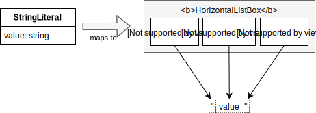
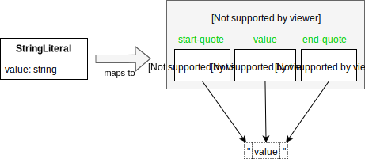

# Defining_Projections

The layout fo everything in ProjectIt is defined using boxes.
A box is a rectangular area in the editor.
The are many different types of boxes in ProjectIt, e.g. a LabelBox for static text, a TextBox for editable text, and SVG box for SVG graphics, etc. etc.

The first step in creating a projectional editor is o define the projection for language.
To do this, you need to define a mapping from the constructs in your language to _boxes_.

A small example to start with:



In the language we are using we have the concept of a _StringLiteral_.
The projection maps this to a horizontal list of labels with fixed text ",
an editable text with the value of the StringLiteral and then another label.

In TypeScript this projection might look something like:
```javascript
new HorizontalListBox( [
        new LabelBox("\""),
        new TextBox(stringLiteral.value),
        new LabelBox("\"")
    ]);
```

We can see that the user interacts with the projection.
To be able to define the user interaction, we need to be able to know
which part of the projection the user is working with.

Therefore we need to know of which element in the model/AST a box is a projection
and also be able to distinguish the different boxes for one element.
For this purpose we give each Box in the projection a _role_.



In this picture the roles are shown above the boxes in green.
We cabn now show the full typescript code for creating this projection.
Given  that `literal` is the StringLiteral object:

```javascript
include::{demodir}/editor/DemoProjection.ts[tag=StringLiteral,indent=0]
```

- The overall horizontal list box to group everything
- The first label box for the start quote
- The text box for the value of the string literal
- The second label box for the end quote

All box roles within the projection for a specific element should have a unique role.
This way we cn identify every box buy its model element + its role.

## Box
A Box is an abstract class describing the features that are common for all boxes.
As explained earlier, each box has a mandatory model element and role.

## LabelBox
A LabelBox shows a non-editable text.
The text itself can either be a fixed string (1) ,  or it can be defined as a function (2).

```javascript
new LabelBox(element, "role", "fixed text")         <1>
new LabelBox(element, "role", () => element.value)  <2>
```

## TextBox
A TextBox shows an editable text.
In addition to the element and the role a text box needs two function parameters.
The first function to get the value of the text,
the second function to set the value of the text.

```javascript
new TextBox(
    element,
    "role",
    () => element.stringValue,
    (newValue: string) => element.stringValue = newValue
)
```


There is a number of boxes available

| Primitive Boxes | Grouping boxes    |
|-----------------|-------------------|
| LabelBox        | HorizontalListBox |
| TextBox         | VerticalListBox   |
| LineBox         | GridBox           |
| TextBox         |                   |
| SpacerBox       |                   |
| AliasBox        |                   |


## SvgBox

## ListBox

### HorizontalListBox

### VerticalListBox

### VerticalModelElementListBox

## GridBox

## SelectBox

## AliasBox